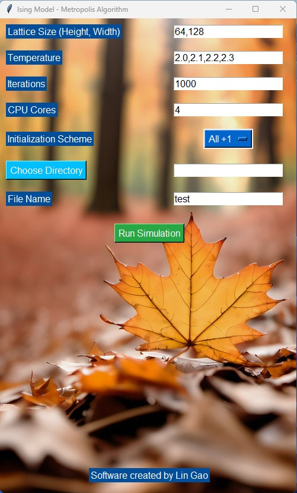

Introduction
============
This program provides a graphical interface for the Metropolis algorithm of the Ising model.
Due to upload size restrictions, the software cannot be uploaded in its entirety. This software is free. If you need software, contact email silvester_gao@qq.com

Usage Instructions
============

1.Running the Simulation:

Input the desired parameters (lattice size, temperatures, iterations, etc.) into the GUI fields.
Press the Run Simulation button to start the process. In addition, this software supports parallel computing, and you can specify the number of CPU cores yourself.

2.Customization:

Background image can be customized by replacing the background.jpg file used in the GUI.

3.Data Saving:

Results, including final lattice states and magnetization data, are automatically saved in the specified directory.

Example
============

